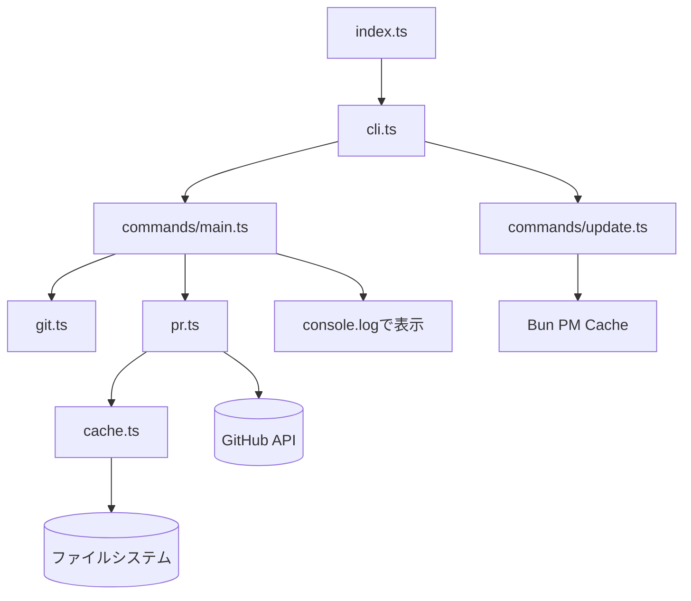

# GitHub PR Info

現在の Git ブランチに関連する GitHub Pull Request 情報を表示するスクリプト

## 概要

このスクリプトは、現在の Git ブランチに Pull Request が存在する場合、その番号とタイトルをターミナルハイパーリンク付きで表示します。Starship プロンプトのカスタムモジュールとして使用することを想定しています。

## 機能

- 現在のブランチの PR 情報を`gh`コマンドで取得
- PR 番号をクリック可能なリンクとして表示（対応ターミナルのみ）
- ブランチごとにキャッシュして高速化
- ブランチ切り替えを検出して自動更新

## 必要要件

- Bun
- GitHub CLI (`gh`)
- Git リポジトリ

## 使用方法

### 基本的な使用

Starship の設定ファイル（`starship.toml`）に本 CLI を追加：

```toml
# グローバル設定
# gh pr view を実行するため、デフォルトの500msから延長
command_timeout = 1000

# モジュール設定
[custom.github_pr]
command = "bunx github:miyaoka/github-pr-info"
when = "git rev-parse --git-dir"
```

### キャッシュのクリア

bunx のパッケージキャッシュをクリアして最新版を取得する場合：

```bash
bunx github:miyaoka/github-pr-info update
```

### 表示例

- PR あり: `#123 Fix critical bug`（#123 がクリック可能）
- PR なし: `[no PR]`
- gh コマンド未インストール: `[gh not installed]`

## 開発

### インストール

```sh
# ツールインストール
mise install

# パッケージインストール
pnpm install
```

### 主要コマンド

```sh
# cli実行
pnpm run dev

# チェック
pnpm run typecheck
pnpm run lint --fix
pnpm run test
```

### デバッグ

環境変数 `GITHUB_PR_INFO_DEBUG=1` を設定するか、-d オプションをつけると詳細なデバッグ情報が `/tmp/github_pr_info_debug.log` に出力されます。

### キャッシュ

#### ディレクトリ構造

```
~/.cache/github_pr_info/
└── {repo_hash}/          # リポジトリパスのSHA256ハッシュ（16文字）
    ├── HEAD              # 最後に参照したブランチ名
    └── refs/
        └── {branch}.json # ブランチごとのPR情報
```

#### キャッシュ処理

キャッシュは以下の場合に再取得されます：

- 初回実行時
- ブランチ切り替え時
- キャッシュが 24 時間経過した時

### ファイル構成

- `index.ts` - メインエントリポイント
- `cli.ts` - CLI 定義（gunshi）
- `commands/` - コマンド実装
  - `main.ts` - メインコマンド
  - `update.ts` - update サブコマンド
- `git.ts` - Git 情報取得
- `pr.ts` - GitHub PR 情報取得
- `cache.ts` - キャッシュ管理
- `utils/` - ユーティリティ関数
  - `result.ts` - エラーハンドリング
  - `debug.ts` - デバッグ出力

#### アーキテクチャ



#### 処理フロー

##### メインコマンド

1. **index.ts** → **cli.ts**: CLI 起動
2. **cli.ts** → **main.ts**: メインコマンド実行
3. **main.ts** → **git.ts**: Git 情報取得（リポジトリルート、現在のブランチ）
4. **main.ts** → **pr.ts**: PR 情報取得要求（GitInfo を渡す）
5. **pr.ts** → **cache.ts**: `getCache(gitInfo)`でキャッシュ確認
6. **pr.ts** → **GitHub API**: キャッシュがない場合、`gh pr view`で PR 情報取得してキャッシュ保存
7. **pr.ts** → **main.ts**: PRInfo 返却
8. **main.ts** → **表示**: ターミナルにハイパーリンク付きで出力

##### update サブコマンド

1. **index.ts** → **cli.ts**: CLI 起動
2. **cli.ts** → **update.ts**: update サブコマンド実行
3. **update.ts** → **Bun PM Cache**: `bun pm cache rm`でキャッシュクリア
